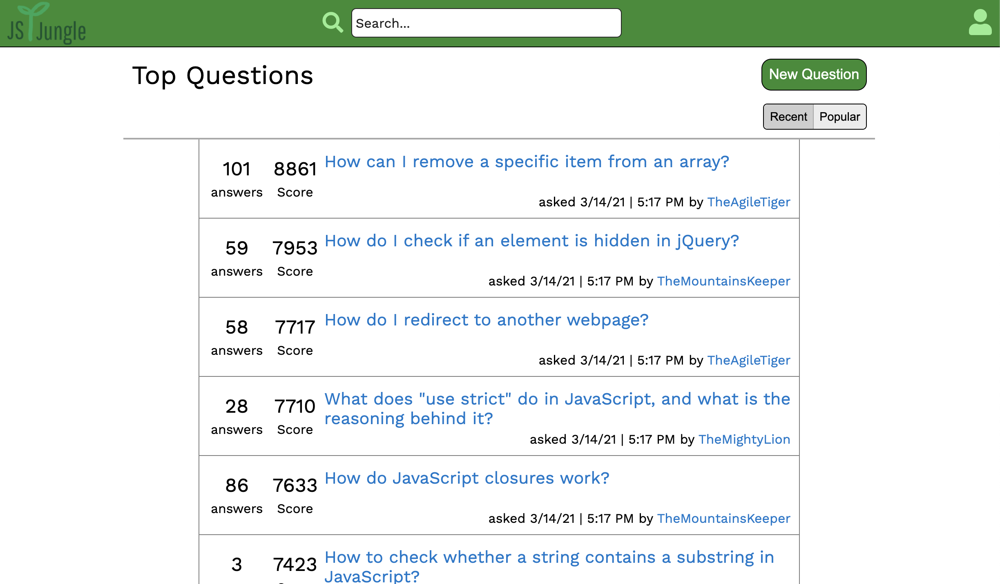

# JavaScript Jungle

_By Joshua Alan, Jacob Premo, Andrew Dotterer, and Giiaga Agha - [Visit JavaScript Jungle](https://jsjungle.herokuapp.com/)_

**Table of Contents**

- [Application Architecture & Technologies Used](#application-architecture)
- [Frontend Overview](#frontend-overview)
- [Backend Overview](#backend-overview)
- [Getting Started](#getting-started)
- [Updates](#updates)

Meant to be a clone of [StackOverflow](https://www.stackoverflow.com), the updated project can be found [here](https://jsjungle.herokuapp.com/), while the original project and repo can be found [here](https://javascriptjungle.herokuapp.com) and [here](https://github.com/Giiaga/JavaScriptJungle), respectively.

# Application Architecture


# Frontend Overview

### _Pug_

The template engine implemented by Node.js.

### _Homepage Filters_

Sort threads by most Recent and most Popular



# Backend Overview

### _Sequelize_

Sequelize establishes the database, models, and seeders. Seeder data fills Pug templates.

### _Express_

Express handles all routes using RESTful API and sends all information from the database.

### _API Routes (routes/index.js)_

```JS
  const homeRouter = require('./home');
  const usersRouter = require('./users');
  const apiRouter = require('./api');
  const questionRouter = require('./questions');
  const postRouter = require('./posts');
```

# Getting Started

### Prerequisites

This is an example of how to list things you need to use the software and how to install them.

- npm

  ```sh
  npm install npm@latest -g
  ```

### Installation

1. Clone the repo
   ```sh
   git clone https://github.com/jm-alan/JSJ-retooling
   ```
2. Install NPM packages
   ```sh
   npm install
   ```
3. Make a .env file

   ```JS
   DB_USERNAME=junglemaster
   DB_PASSWORD=password
   DB_DATABASE=db_name
   DB_HOST=localhost
   JWT_SECRET=your_secret
   JWT_EXPIRES_IN=604800
   SESSION_SECRET=your_secret
   ```

4. Sequelize commands
   ```JS
   (First)
   npx dotenv sequelize db:create
   ```
   ```JS
   (Second)
   npx dotenv sequelize db:migrate
   ```
   ```JS
   (Third)
   npx dotenv sequelize db:seed:all
   ```
5. Start the app

   ```JS
   npm start
   ```

6. Go to localhost:8080

   ```JS
   http://localhost:8080/
   ```

# Updates

_12/07/2020_

Fixed a bug where voting and delete functionality was not active on AJAX-rendered new answers to a question.

_12/07/2020_

Created a new primary site user whose account is not accessible to the public, protecting the seeded content from unnecessary modifications.

_12/11/2020_

A fatal security bug allowed a potential user to submit an additional "question" to a thread via public API, and then delete that question, causing a cascade delete of the thread, effectively allowing users to delete any question they want regardless of post owner. This has been patched.

_12/13/2020_

Fixed a previously unnoticed issue causing the "recent" page to display each individual page in reverse order.

_12/13/2020_

Finally fixed a major, but intermittent issue that would cause threads not to delete correctly when deleting their corresponding question. Due to the way the homepage query is written, this was also causing a cascade effect where a thread existing with no posts would prevent the rendering of the entire homepage. That poor dependency has not yet been patched, but it should not present again in the immediate future.

_12/13/2020_

API to post new questions now follows a more RESTful design.

_12/13/2020_

Phase 1 of abstracting many of the front-end functions into their own files to make the code more modular, and consequently more maintainable.

_12/18/2020_

Added a bit of flare to the vote buttons on hover/click, and added persistent visual indication that a given logged-in user has voted on a given post.

_01/17/2021_

Posts are now editable

_01/17/2021_

The implementation of the homepage fetch functionality has been rebuilt from the ground up, with new, modular, scalable API routes. This has the added benefit of patching the dreaded bodyless thread homepage render fail bug mentioned earlier.

_03/15/2021_

Updated Readme, CSS, & more
